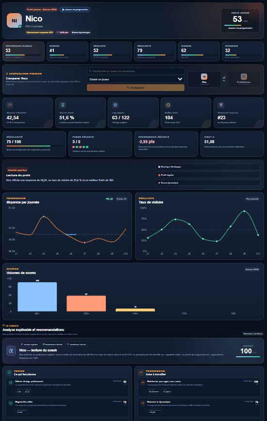
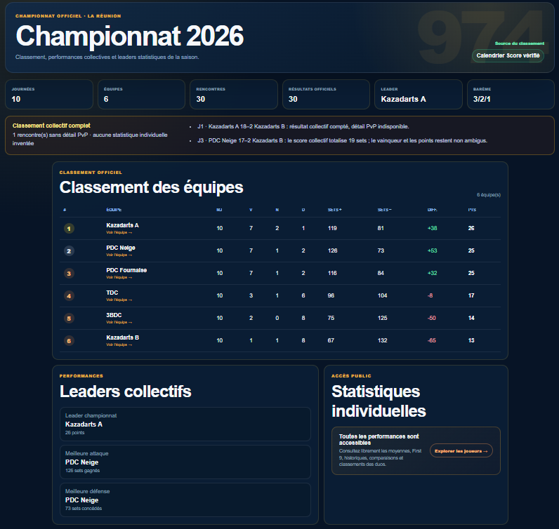
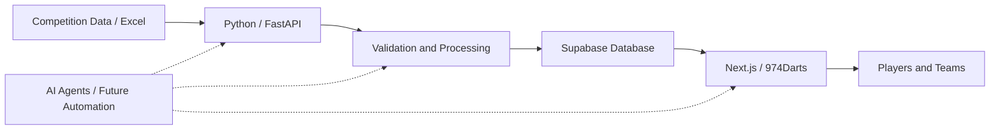

<p align="center">
  
</p>

**Continuous Improvement × Data × Automation × Artificial Intelligence**
---
---

## 📊 Platform in Action

974Darts goes beyond a traditional reporting dashboard.

The platform transforms competition data into accessible performance insights — from individual player analytics to championship-level performance monitoring.

### 🎯 Player Analytics

Detailed player performance analysis combining scoring, consistency, finishing, progression and match results.

<p align="center">
  
</p>

Player profiles bring together multiple performance dimensions to provide a structured view of strengths, progression and areas for improvement.

---

### 🏆 Championship Performance

Competition data is consolidated into a central view covering championship progression, official rankings and collective team performance.

<p align="center">
  
</p>

This provides players and teams with a shared and accessible view of the competition based on verified match data.

> **From raw competition data to accessible, measurable and actionable performance insights.**

---

---

## 🏗️ Platform Architecture

974Darts progressively evolved from a Power BI reporting project into a complete data processing and publishing platform.

The current architecture separates data collection, processing, validation, storage and presentation.


### ⚙️ Current Workflow

**Competition Data → Python / FastAPI → Validation & Processing → Supabase → Next.js / 974Darts → Players & Teams**

The objective is to maintain a reliable and repeatable flow between raw competition data and the statistics published on the platform.

### 🤖 Evolution Target

The next stage is to progressively introduce automation and AI Agents across the workflow:

**Collection → Control → Processing → Analysis → Publication**

Automation is introduced where it creates measurable value: reducing repetitive manual operations, improving data reliability and focusing human intervention on analysis and decision-making.

---

## 💡 What This Project Demonstrates

974Darts is both a functional product and a practical experimentation environment.

It demonstrates how several disciplines can be combined around a real-world problem:

**Continuous Improvement × Lean Six Sigma × Data Analytics × Python × Web Development × Automation × Artificial Intelligence**

> **Understand the problem. Measure what matters. Improve the process. Control the result. Automate where it creates value.**

---
# 🔧 Technical Documentation

The original development documentation is maintained below in French, reflecting the project's development history.

> The section below contains the original technical documentation of the 974Darts development environment.


# 974 Darts AI Web — v0.10 / Sprint 3.1

Cette version publie réellement le championnat dans Supabase via un backend Python FastAPI.

## Fonctionnement

1. Next.js authentifie l'administrateur.
2. Le fichier Excel est transmis au backend FastAPI.
3. FastAPI analyse l'onglet `PvP`.
4. Les lignes T1/T2 sont exclues du championnat.
5. Le bouton **Publier** crée ou met à jour :
   - saisons ;
   - journées ;
   - équipes ;
   - joueurs ;
   - rencontres ;
   - matchs ;
   - legs ;
   - statistiques joueur-leg ;
   - historique d'import ;
   - anomalies.
6. Le SHA-256 du fichier empêche une double publication.

## Mise à niveau depuis la v0.7

1. Décompresser cette version dans un nouveau dossier.
2. Copier l'ancien `.env.local`.
3. Ajouter dans `.env.local` :

```env
PYTHON_API_URL=http://127.0.0.1:8000
INTERNAL_API_TOKEN=UNE_LONGUE_VALEUR_ALEATOIRE
ALLOWED_ORIGIN=http://localhost:3000
```

4. Dans Supabase SQL Editor, exécuter le contenu de :

`supabase/migration_v0_8_publication.sql`

5. Exécuter `INSTALLER_WINDOWS.bat`.
6. Exécuter `LANCER_SITE.bat`.

Deux fenêtres restent ouvertes :
- FastAPI sur le port 8000 ;
- Next.js sur le port 3000.

## Test

- Backend : `http://127.0.0.1:8000/health`
- Site : `http://localhost:3000/admin`

Analyse le classeur, puis clique sur **Publier**.

## Sécurité

- Le navigateur ne connaît jamais la clé secrète Supabase.
- Next.js vérifie le rôle ADMIN.
- Next.js et FastAPI utilisent un token interne.
- FastAPI utilise la clé serveur uniquement dans son processus local.
- Ne partage jamais `.env.local`.
