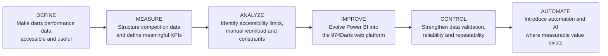
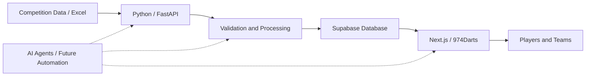

<p align="center">
  
</p>

**Continuous Improvement × Data × Automation × Artificial Intelligence**
---

---

## 🧠 974Darts through DMAIC

974Darts follows the same structured problem-solving mindset I use in Continuous Improvement initiatives.



### From Continuous Improvement to Digital Improvement

The methodology remains the same even when the tools evolve.

**DEFINE** the problem.  
**MEASURE** what matters.  
**ANALYZE** the causes and limitations.  
**IMPROVE** the process and the solution.  
**CONTROL** reliability and performance.  

And when it creates value:

### 🤖 AUTOMATE

Automation and AI are not the objective by themselves.

They are additional tools to reduce repetitive work, improve reliability and create more time for **analysis, decision-making and continuous improvement**.

> **DEFINE → MEASURE → ANALYZE → IMPROVE → CONTROL → AUTOMATE**

---
## 📊 Platform in Action

974Darts goes beyond a traditional reporting dashboard.

The platform transforms competition data into accessible performance insights — from individual player analytics to championship-level performance monitoring.

### 🎯 Player Analytics

Detailed player performance analysis combining scoring, consistency, finishing, progression and match results.

<p align="center">
  
</p>

Player profiles bring together multiple performance dimensions to provide a structured view of strengths, progression and areas for improvement.

---

### 🏆 Championship Performance

Competition data is consolidated into a central view covering championship progression, official rankings and collective team performance.

<p align="center">
  
</p>

This provides players and teams with a shared and accessible view of the competition based on verified match data.

> **From raw competition data to accessible, measurable and actionable performance insights.**

---

---

## 🏗️ Platform Architecture

974Darts progressively evolved from a Power BI reporting project into a complete data processing and publishing platform.

The current architecture separates data collection, processing, validation, storage and presentation.


### ⚙️ Current Workflow

**Competition Data → Python / FastAPI → Validation & Processing → Supabase → Next.js / 974Darts → Players & Teams**

The objective is to maintain a reliable and repeatable flow between raw competition data and the statistics published on the platform.

### 🤖 Evolution Target

The next stage is to progressively introduce automation and AI Agents across the workflow:

**Collection → Control → Processing → Analysis → Publication**

Automation is introduced where it creates measurable value: reducing repetitive manual operations, improving data reliability and focusing human intervention on analysis and decision-making.

---

## 💡 What This Project Demonstrates

974Darts is both a functional product and a practical experimentation environment.

It demonstrates how several disciplines can be combined around a real-world problem:

**Continuous Improvement × Lean Six Sigma × Data Analytics × Python × Web Development × Automation × Artificial Intelligence**

> **Understand the problem. Measure what matters. Improve the process. Control the result. Automate where it creates value.**

---
---

## 🔧 Technical Highlights

974Darts is a production web platform built around a Python-based data processing backend and a modern web interface.

### 🧩 Core Stack

**Frontend**
- Next.js
- TypeScript
- React components

**Backend**
- Python
- FastAPI
- Data validation and transformation logic

**Data**
- Supabase
- Structured competition datasets
- Player, team, match and leg-level statistics

**Quality & Security**
- Git version control
- Secret scanning
- Push protection
- Dependabot
- CodeQL analysis

---

## ⚙️ Data Processing Logic

Competition data is processed through a controlled workflow before publication.
Simplified representation of the processing logic:
```python
def process_competition_data(source):
    raw_data = load_source(source)
    validated_data = validate_competition_rules(raw_data)
    structured_data = transform_statistics(validated_data)
    return structured_data
```

The objective is to separate:

**Input → Validation → Transformation → Storage → Publication**

This makes the workflow easier to control, test and progressively automate.

---

## 🛡️ Validation & Business Rules

The platform includes controls designed to improve reliability before data is published.

Examples include:

```python
if match.is_excluded:
    skip_match()

if publication_hash_exists(file_hash):
    prevent_duplicate_publication()

validate_players()
validate_teams()
validate_matches()
validate_legs()
```

These controls are particularly important because the platform publishes competition statistics that must remain consistent across players, teams and rankings.

---

## 🔄 Backend API

FastAPI provides the bridge between data processing and the web platform.

```python
@app.post("/publish")
async def publish_competition(file: UploadFile):
    data = await process_file(file)
    validated = validate_data(data)
    result = publish_to_database(validated)
    return result
```

This architecture allows the processing logic to remain independent from the user interface.

---

## 🗄️ Data Model

The platform progressively structures competition data around several connected entities:

```text
Season
 ├── Matchdays
 │    └── Matches
 │         └── Legs
 │
 ├── Teams
 └── Players
      └── Performance Statistics
```

This structure supports both individual analytics and championship-level reporting.

---

## 🤖 Automation Direction

The current architecture is designed to progressively support more automation.

Future workflows include:

```text
Competition Data
      ↓
Automated Collection
      ↓
Validation
      ↓
Processing
      ↓
Statistical Analysis
      ↓
Database Update
      ↓
Web Publication
      ↓
AI-assisted Insights
```

The objective is to progressively reduce repetitive manual operations while maintaining data quality and traceability.

---

## 👨‍💻 Explore the Code

The repository contains the real development structure behind 974Darts.

Key areas include:

- `/backend` — Python / FastAPI processing
- `/app` — application structure
- `/components` — reusable interface components
- `/lib` — shared application logic
- `/supabase` — database-related resources
- `/docs` — project documentation

The project continues to evolve through iterative development and Continuous Improvement.

---
